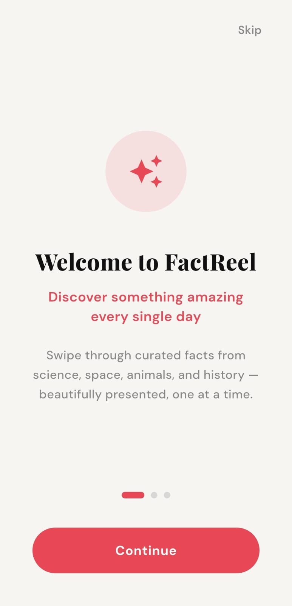
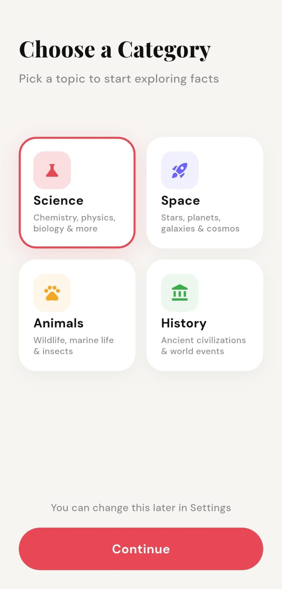
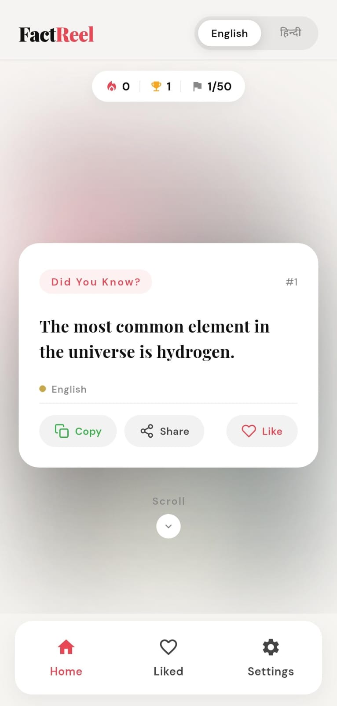
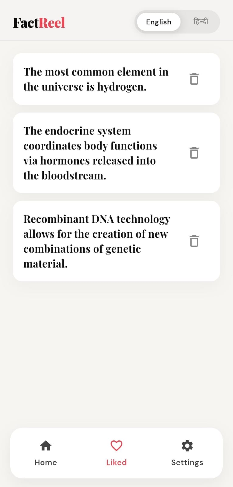
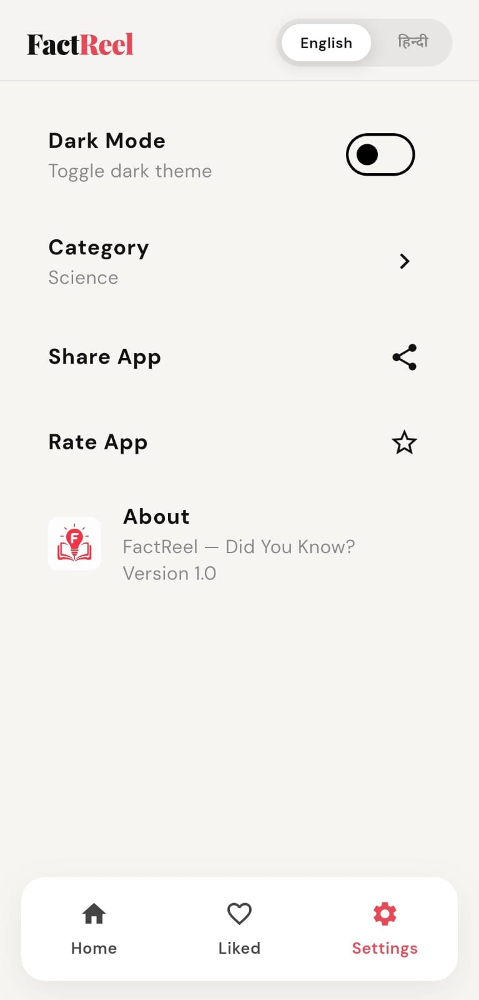
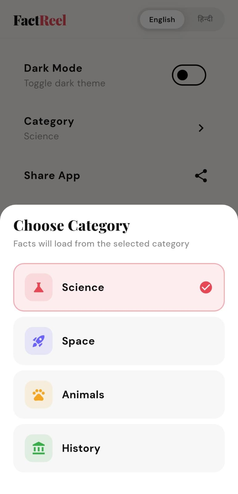

<div align="center">


<br/>

*A modern, highly engaging Flutter application that lets users scroll through a fascinating feed of random, interesting facts across various categories.*

<br/>


</div>

---

## 📖 Overview

**FactReel** is an engaging and addictive knowledge app that presents interesting facts in an infinite-scrolling reel format. Users can select categories like Cat Facts, Useless Facts, or custom facts and swipe through them seamlessly. It features a stunning, dynamic user interface with a built-in Dark & Light mode toggle, offering a modern experience similar to popular short-form content apps.

---

## 🌟 Key Features

- **📜 Infinite Scroll Feed** — Scroll endlessly through fascinating facts in a reel-like interface.
- **🗂️ Category Selection** — Choose specific topics (Cats, general useless facts, custom sets) during onboarding to curate your feed.
- **🌓 Dynamic Theming** — Built-in Light and Dark mode support for a comfortable reading experience at any time.
- **⚡ Fast & Responsive UI** — Built entirely with Flutter, ensuring buttery smooth scrolling and animations.
- **📤 Share Facts** — Easily share your favorite facts with friends using the built-in share functionality.
- **💾 Local Storage** — Remembers user preferences and themes using `shared_preferences`.

---

## 🛠️ Tech Stack

| Layer                         | Technology                                             |
|--------------------------------|---------------------------------------------------------|
| Framework                     | Flutter & Dart                                         |
| UI / Styling                  | `google_fonts`, `cupertino_icons`, `flutter_svg`       |
| State & Storage               | `shared_preferences`                                   |
| Sharing Functionality         | `share_plus`                                           |

---

## 📂 Project Structure

```text
lib/
│
├── app/                          # App core setup, routing, and theming
│   ├── app_router.dart
│   ├── factreel_app.dart
│   └── theme_controller.dart
│
├── features/
│   ├── fact_feed/                # Fact scrolling feed & cards
│   │   └── presentation/
│   │       └── widgets/
│   │
│   └── onboarding/               # Onboarding and category selection screens
│       └── presentation/
│
└── main.dart                     # App entry point
```

---

## 🖼️ App Screenshots

<table>
  <tr>
    <td></td>
    <td></td>
    <td></td>
  </tr>
  <tr>
    <td></td>
    <td></td>
    <td></td>
  </tr>
  <tr>
    <td></td>
    <td></td>
    <td></td>
  </tr>
</table>

> 💡 **Note:** Screenshots are loaded from the `assets/screenshots/` folder in this repository. Ensure the folder is committed for images to render correctly on GitHub.

---

## 🚀 Installation & Setup

1. **Clone the repository**
   ```bash
   git clone <your-repository-url>
   cd factscroll
   ```

2. **Install dependencies**
   ```bash
   flutter pub get
   ```

3. **Run the app**
   ```bash
   flutter run
   ```

---

## 🗺️ Roadmap

- [ ] Add bookmarking feature to save favorite facts.
- [ ] Implement backend API integration for fetching live facts.
- [ ] Add offline support for downloaded fact packs.
- [ ] Implement audio narration (Text-to-Speech) for facts.

---

<div align="center">

### 🧠 Keep Learning with FactReel

**FactReel** — *Scroll through knowledge.*

</div>
